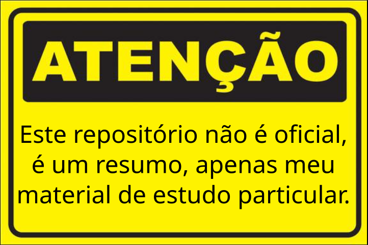

# Programação Rust

---

 [Dicas](https://github.com/arataca89/rust/blob/main/dicas.md)

[Rust através de exemplos](https://github.com/arataca89/rust/blob/main/rust_by_example.md)

---

[panic!](https://github.com/arataca89/rust/blob/main/panic.md)

[assert_eq!](https://github.com/arataca89/rust/blob/main/assert_eq.md)

[Tupla](https://github.com/arataca89/rust/blob/main/tuple.md)

[str](https://github.com/arataca89/rust/blob/main/str.md)

[String](https://github.com/arataca89/rust/blob/main/string.md)

[Vec](https://github.com/arataca89/rust/blob/main/vec.md)

[Ownership (propriedade)](https://github.com/arataca89/rust/tree/main/ownership)

[Estrutura (struct)](https://github.com/arataca89/rust/blob/main/structs.md)

[Result](https://github.com/arataca89/rust/blob/main/result.md)

[Tratamento de erro - panic! e Result](https://github.com/arataca89/rust/blob/main/erro.md)

[Option](https://github.com/arataca89/rust/blob/main/option.md)

[Genéricos](https://github.com/arataca89/rust/tree/main/genericos)

[Traits](https://github.com/arataca89/rust/tree/main/traits)

[Traits deriváveis](https://github.com/arataca89/rust/blob/main/derivable_traits.md)

[Lifetimes (tempos de vida)](https://github.com/arataca89/rust/tree/main/lifetimes)

[Closures](https://github.com/arataca89/rust/tree/main/closures)

[Iteradores](https://github.com/arataca89/rust/tree/main/iteradores)

[Iteradores - Módulo iter](https://github.com/arataca89/rust/blob/main/module_iter.md)

[Iteradores - métodos](https://github.com/arataca89/rust/blob/main/iterators_methods.md)

---

[Escrevendo um programa de linha de comando - minigrep](https://github.com/arataca89/rust/tree/main/minigrep)

[minigrep2 - melhorando o código do minigrep com iterators](https://github.com/arataca89/rust/tree/main/minigrep2)

---

arataca89@gmail.com

Última atualização: 20250105
