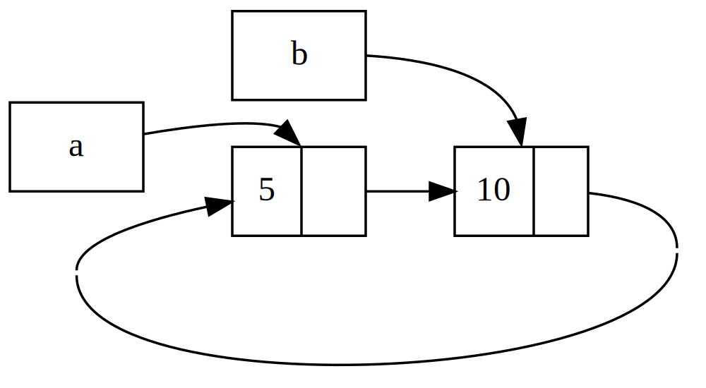

#### arataca89

# Linguagem Rust - Smart Pointers

[Introdução](#introdução)

[Box&lt;T&gt;](#boxt)

- [Usando Box<T> para apontar para dados na memória heap](#usando-boxt-para-apontar-para-dados-na-mem%C3%B3ria-heap)
- [Habilitando tipos recursivos com Box](#habilitando-tipos-recursivos-com-box)

[Tratando Ponteiros Inteligentes como referências  com a trait Deref](#tratando-ponteiros-inteligentes-como-referências-com-a-trait-deref)

- [Seguindo o ponteiro para o valor](#seguindo-o-ponteiro-para-o-valor)
- [Usando `Box<T>` como uma referência](#usando-boxt-como-uma-refer%C3%AAncia)
- [Definindo seu próprio smart pointer](#definindo-seu-pr%C3%B3prio-smart-pointer)
- [Implementando a trait `Deref`](#implementando-a-trait-deref)
- [Coerções implícitas de desreferência com funções e métodos](#coer%C3%A7%C3%B5es-impl%C3%ADcitas-de-desrefer%C3%AAncia-com-fun%C3%A7%C3%B5es-e-m%C3%A9todos)
- [Como a coerção de desreferência interage com a mutabilidade](#como-a-coer%C3%A7%C3%A3o-de-desrefer%C3%AAncia-interage-com-a-mutabilidade)

[Executando código na limpeza com a trait Drop](#executando-c%C3%B3digo-na-limpeza-com-a-trait-drop)

- [Liberando um valor antecipadamente com std::mem::drop](#liberando-um-valor-antecipadamente-com-stdmemdrop)

[Rc<T>, o ponteiro inteligente com contagem de referências](#rct-o-ponteiro-inteligente-com-contagem-de-refer%C3%AAncias)

- [Usando `Rc<T>` para compartilhar dados ](#usando-rct-para-compartilhar-dados)
- [Clonar um `Rc<T>` aumenta a contagem de referência](#clonar-um-rct-aumenta-a-contagem-de-refer%C3%AAncia)

[`RefCell<T>` e o padrão de mutabilidade interna](#refcellt-e-o-padr%C3%A3o-de-mutabilidade-interna)

- [Impondo regras de empréstimo em tempo de execução com `RefCell<T>`](#impondo-regras-de-empr%C3%A9stimo-em-tempo-de-execu%C3%A7%C3%A3o-com-refcellt)
- [Mutabilidade Interna: um empréstimo mutável para um valor imutável](#mutabilidade-interna-um-empr%C3%A9stimo-mut%C3%A1vel-para-um-valor-imut%C3%A1vel)
- [Um caso de uso para mutabilidade interna: mock objects](#um-caso-de-uso-para-mutabilidade-interna-mock-objects)
- [Controlando empréstimos em tempo de execução com `RefCell<T>`](#controlando-empr%C3%A9stimos-em-tempo-de-execu%C3%A7%C3%A3o-com-refcellt)

[Tendo vários proprietários de dados mutáveis ​​combinando `Rc<T>` e `RefCell<T>`](#tendo-v%C3%A1rios-propriet%C3%A1rios-de-dados-mut%C3%A1veis-combinando-rct-e-refcellt)


[Ciclos de referências podem vazar memória](#ciclos-de-refer%C3%AAncias-podem-vazar-mem%C3%B3ria)

- [Criando um ciclo de referências](#criando-um-ciclo-de-refer%C3%AAncias)
- [Prevenindo ciclos de referência: transformando um `Rc<T>` em um `Weak<T>`](#prevenindo-ciclos-de-refer%C3%AAncia-transformando-um-rct-em-um-weakt)
	- [Criando uma estrutura de dados àrvore: um nó com nós filhos](#criando-uma-estrutura-de-dados-%C3%A0rvore-um-n%C3%B3-com-n%C3%B3s-filhos)
	- [Adicionando uma referência de um filho ao seu pai](#adicionando-uma-refer%C3%AAncia-de-um-filho-ao-seu-pai)
	- [Visualizando mudanças em `strong_count` e `weak_count`](#visualizando-mudan%C3%A7as-em-strong_count-e-weak_count)

[Resumo](#resumo)

---

## Introdução

Um ponteiro é um conceito geral para uma variável que contém um endereço na memória. Este endereço se refere, ou "aponta para", algum outro dado. O tipo mais comum de ponteiro em Rust é uma referência. As referências são indicadas pelo símbolo ```&``` e emprestam o valor para o qual apontam. Elas não têm nenhuma capacidade especial além de se referir a dados e não têm nenhuma sobrecarga.

Os smart pointers (ponteiros inteligentes), por outro lado, são estruturas de dados que agem como um ponteiro, mas também têm metadados e recursos adicionais. O conceito de ponteiros inteligentes não é exclusivo do Rust: ponteiros inteligentes se originaram em C++ e existem em outras linguagens também. O Rust tem uma variedade de ponteiros inteligentes definidos na biblioteca padrão que fornecem funcionalidade além daquela fornecida pelas referências. Para explorar o conceito geral, veremos alguns exemplos diferentes de ponteiros inteligentes, incluindo um tipo de ponteiro inteligente de contagem de referência. Este ponteiro permite que os dados tenham vários proprietários, mantendo o controle do número de proprietários e, quando nenhum proprietário permanecer, limpando os dados.

Rust, com seu conceito de propriedade e empréstimo, tem uma diferença adicional entre referências e ponteiros inteligentes: enquanto referências apenas emprestam dados, em muitos casos, ponteiros inteligentes têm a propriedade dos dados para os quais apontam.

Os tipos ```String``` e ```Vec<T>``` são smart pointers. Ambos contam como ponteiros inteligentes porque possuem alguma memória e permitem que você a manipule. Eles também têm metadados e capacidades ou garantias extras. ```String```, por exemplo, armazena sua capacidade como metadados e tem a capacidade extra de garantir que seus dados serão sempre UTF-8 válido.

Ponteiros inteligentes geralmente são implementados usando structs. Diferentemente de uma ```struct``` comum, ponteiros inteligentes implementam as traits ```Deref``` e ```Drop```. A trait ```Deref``` permite que uma instância da ```struct``` de ponteiro inteligente se comporte como uma referência para que você possa escrever seu código para trabalhar com referências ou ponteiros inteligentes. A trait ```Drop``` permite que você personalize o código que é executado quando uma instância do ponteiro inteligente sai do escopo. Discutiremos aqui ambas as traits e demonstraremos por que elas são importantes para ponteiros inteligentes. 

Visto que o padrão de ponteiro inteligente é um padrão de design geral usado frequentemente em Rust, não serão abordados todos os ponteiros inteligentes existentes. Muitas bibliotecas têm seus próprios ponteiros inteligentes, e você pode até escrever o seu próprio. Serão abordados os ponteiros inteligentes mais comuns na biblioteca padrão:

* ```Box<T>``` para alocar valores na heap;
* ```Rc<T>```, um tipo de contagem de referência que permite múltiplos proprietários;
* ```Ref<T>``` e ```RefMut<T>```, acessados através de ```RefCell<T>```, um tipo que impõe as regras de empréstimo em tempo de execução em vez de tempo de compilação. 

Além disso, será abordado o padrão de mutabilidade interna, onde um tipo imutável expõe uma API para mudar um valor interno. Também serão discutidos ciclos de referência: como eles podem vazar memória e como evitá-los.

---

## Box&lt;T&gt;

O ponteiro inteligente mais direto é uma **Box** (caixa), cujo tipo é escrito ```Box<T>```. Caixas permitem que você armazene dados na memória heap em vez de armazenar na memória pilha. O que permanece na pilha é o ponteiro para os dados da heap.

Caixas não têm sobrecarga de desempenho (overhead de performance), além de armazenar seus dados na heap em vez da pilha. Mas elas também não têm muitas capacidades extras. Você as usará com mais frequência nessas situações:

* Quando você tem um tipo cujo tamanho não pode ser conhecido em tempo de compilação e você deseja usar um valor desse tipo em um contexto que requer um tamanho exato;
* Quando você tem uma grande quantidade de dados e deseja transferir a propriedade, mas garantir que os dados não serão copiados ao fazer isso;
* Quando você deseja a propriedade de um valor e se importa apenas com o fato de que ele é um tipo que implementa uma determinada trait em vez de ser de um tipo específico. 
 
Demonstraremos a primeira situação na seção [Habilitando tipos recursivos com Box](#habilitando-tipos-recursivos-com-box). No segundo caso, transferir a propriedade de uma grande quantidade de dados pode levar muito tempo porque os dados são copiados na pilha. Para melhorar o desempenho nessa situação, podemos armazenar a grande quantidade de dados na heap em uma caixa. Então, apenas a pequena quantidade de dados do ponteiro é copiada na pilha, enquanto os dados aos quais ele faz referência permanecem em um lugar na heap. O terceiro caso é conhecido como **objeto de trait**, e será abordado no capítulo referente a OOP em Rust.

### Usando Box&lt;T&gt; para apontar para dados na memória heap

Antes de discutirmos o caso de uso de armazenamento na heap para ```Box<T>```, abordaremos a sintaxe e como interagir com os valores armazenados dentro de uma `Box<T>`.

O código abaixo mostra como usar uma caixa para armazenar um valor ```i32``` na heap:

```rust
fn main() {
    let b = Box::new(5);
    println!("b = {b}");
}
```

Definimos a variável **b** para ter o valor de uma **Box** que aponta para o valor **5**, que é alocado na heap. Este programa imprimirá ```b = 5```; neste caso, podemos acessar os dados na **Box** de forma semelhante a como faríamos se esses dados estivessem na pilha. Assim como qualquer valor que a função tem a propriedade, quando uma **Box** sai do escopo, como **b** faz no final da função ```main()```, ela será destruída e terá sua memória desalocada. A desalocação acontece tanto para a **Box** (armazenada na pilha) quanto para os dados para os quais ela aponta (armazenados na heap).

Colocar um único valor na heap não é muito útil, então você não usará caixas sozinhas dessa forma com muita frequência. Ter valores como um único ```i32``` na pilha, onde eles são armazenados por padrão, é mais apropriado na maioria das situações. Vamos ver um caso em que as caixas nos permitem definir tipos que não seriam permitidos se não tivéssemos caixas.

### Habilitando tipos recursivos com Box 
 
Um valor de tipo recursivo pode ter outro valor do mesmo tipo como parte de si mesmo. Tipos recursivos representam um problema porque, em tempo de compilação, o Rust precisa saber quanto espaço um tipo ocupa. No entanto, a aninhamento de valores de tipos recursivos poderia teoricamente continuar infinitamente, então o Rust não pode saber quanto espaço o valor precisa. Como as caixas têm um tamanho conhecido, podemos habilitar tipos recursivos inserindo uma caixa na definição do tipo recursivo.

Como exemplo de um tipo recursivo, vamos explorar a ```cons list```. Este é um tipo de dados comumente encontrado em linguagens de programação funcional. O tipo ```cons list``` que definiremos é direto, exceto pela recursão; portanto, os conceitos no exemplo com o qual trabalharemos serão úteis sempre que você entrar em situações mais complexas envolvendo tipos recursivos.

#### Mais informações sobre cons list

Uma ```cons list``` é uma estrutura de dados que vem da linguagem de programação Lisp e seus dialetos e é composta por pares aninhados, sendo a versão Lisp de uma lista encadeada. Seu nome vem da função ```cons()``` (abreviação de "construct function", ou "função de construção") em Lisp que constrói um novo par a partir de seus dois argumentos. Ao chamar ```cons()``` em um par que consiste de um valor e outro par, podemos construir ```cons list``` compostas por pares recursivos.

Por exemplo, aqui está uma representação de pseudocódigo de uma ```cons list``` contendo a lista **1, 2, 3** com cada par entre parênteses:

```
(1, (2, (3, Nil)))
```

Cada item em uma ```cons list``` contém dois elementos: o valor do item atual e o próximo item. O último item na lista contém apenas um valor chamado **Nil** sem um próximo item. Uma ```cons list``` é produzida chamando recursivamente a função ```cons()```. O nome canônico para denotar o caso base da recursão é **Nil**. Observe que isso não é o mesmo que o conceito de "null" ou "nil", que é um valor inválido ou ausente.

A ```cons list``` não é uma estrutura de dados comumente usada em Rust. Na maioria das vezes, quando você tem uma lista de itens em Rust, ```Vec<T>``` é uma escolha melhor para usar. Outros tipos de dados recursivos mais complexos são úteis em várias situações, mas começando com a ```cons list``` neste capítulo, podemos explorar como as **Box** nos permitem definir um tipo de dados recursivo sem muita distração.

O código abaixo contém uma definição de ```enum``` para uma ```cons list```. Note que este código ainda não irá compilar porque o tipo **List** não tem um tamanho conhecido, o que demonstraremos.

```rust
enum List {
    Cons(i32, List),
    Nil,
}
```

Note que estamos implementando uma ```cons list``` que contém apenas valores ```i32``` para fins deste exemplo. Poderíamos tê-la implementado usando genéricos, para definir um tipo de ```cons list``` que poderia armazenar valores de qualquer tipo.

Usar o tipo **List** para armazenar a lista 1, 2, 3 ficaria assim:

```rust
use crate::List::{Cons, Nil};

fn main() {
    let list = Cons(1, Cons(2, Cons(3, Nil)));
}
```

O primeiro valor ```Cons``` contém 1 e outro valor **List**. Este valor **List** é outro valor ```Cons``` que contém 2 e outro valor **List**. Este valor **List** é mais um valor ```Cons``` que contém 3 e um valor **List**, que é finalmente **Nil**, a variante não recursiva que sinaliza o fim da lista.

Se tentarmos compilar este código, obtemos o erro mostrado abaixo:

```
$ cargo run
   Compiling cons-list v0.1.0 (file:///projects/cons-list)
error[E0072]: recursive type `List` has infinite size
 --> src/main.rs:1:1
  |
1 | enum List {
  | ^^^^^^^^^
2 |     Cons(i32, List),
  |               ---- recursive without indirection
  |
help: insert some indirection (e.g., a `Box`, `Rc`, or `&`) to break the cycle
  |
2 |     Cons(i32, Box<List>),
  |               ++++    +

error[E0391]: cycle detected when computing when `List` needs drop
 --> src/main.rs:1:1
  |
1 | enum List {
  | ^^^^^^^^^
  |
  = note: ...which immediately requires computing when `List` needs drop again
  = note: cycle used when computing whether `List` needs drop
  = note: see https://rustc-dev-guide.rust-lang.org/overview.html#queries and https://rustc-dev-guide.rust-lang.org/query.html for more information

Some errors have detailed explanations: E0072, E0391.
For more information about an error, try `rustc --explain E0072`.
error: could not compile `cons-list` (bin "cons-list") due to 2 previous errors
```

O erro mostra a mensagem "tem tamanho infinito". A razão é que definimos **List** com uma variante que é recursiva: ela contém outro valor de si mesma diretamente. Como resultado, o Rust não consegue descobrir quanto espaço precisa para armazenar um valor **List**. Vamos analisar por que recebemos esse erro. Primeiro, veremos como o Rust decide quanto espaço precisa para armazenar um valor de um tipo não recursivo.

#### Calculando o tamanho de um tipo não recursivo

Dada a enumeração:

```rust
enum Message {
    Quit,
    Move { x: i32, y: i32 },
    Write(String),
    ChangeColor(i32, i32, i32),
}
```

Para determinar quanto espaço alocar para um valor **Message**, Rust percorre cada uma das variantes para ver qual variante precisa de mais espaço. Rust vê que **Message::Quit** não precisa de espaço, **Message::Move** precisa de espaço suficiente para armazenar dois valores ```i32```, e assim por diante. Como apenas uma variante será usada, o maior espaço que um valor **Message** precisará é o espaço que levaria para armazenar a maior de suas variantes.

Compare isso com o que acontece quando Rust tenta determinar quanto espaço um tipo recursivo como o **List**,mostrado mais acima, precisa. O compilador começa olhando para a variante **Cons**, que contém um valor do tipo **i32** e um valor do tipo **List**. Portanto, **Cons** precisa de uma quantidade de espaço igual ao tamanho de um **i32** mais o tamanho de uma **List**. Para descobrir quanta memória o tipo **List** precisa, o compilador olha para as variantes, começando com a variante **Cons**. A variante **Cons** contém um valor do tipo **i32** e um valor do tipo **List**, e esse processo continua infinitamente, como mostrado na figura abaixo.


#### Usando Box&lt;T&gt; para obter um tipo recursivo com tamanho conhecido

Como o Rust não consegue determinar quanto espaço alocar para tipos definidos recursivamente, o compilador gera um erro com esta sugestão útil:

```
help: insert some indirection (e.g., a `Box`, `Rc`, or `&`) to break the cycle
  |
2 |     Cons(i32, Box<List>),
  |               ++++    +
```

Nesta sugestão, "indireção" significa que, em vez de armazenar um valor diretamente, devemos mudar a estrutura de dados para armazenar o valor indiretamente, armazenando um ponteiro para o valor em vez do valor propriamente dito.

Como um ```Box<T>``` é um ponteiro, o Rust sempre sabe quanto espaço um ```Box<T>``` precisa: o tamanho de um ponteiro não muda com base na quantidade de dados para os quais ele está apontando. Isso significa que podemos colocar um ```Box<T>``` dentro da variante **Cons** em vez de outro valor **List** diretamente. O ```Box<T>``` apontará para o próximo valor **List** que estará na heap em vez de dentro da variante **Cons**. Conceitualmente, ainda temos uma lista, criada com listas contendo outras listas, mas essa implementação agora é mais como colocar os itens um ao lado do outro em vez de um dentro do outro.

Podemos agora alterar a definição da **enum List** e sua utilização com, um código que irá compilar.

```rust
enum List {
    Cons(i32, Box<List>),
    Nil,
}

use crate::List::{Cons, Nil};

fn main() {
    let list = Cons(1, Box::new(Cons(2, Box::new(Cons(3, Box::new(Nil))))));
}
```

A variante **Cons** precisa do tamanho de um ```i32``` mais o espaço para armazenar os dados do ponteiro da ```Box```. A variante **Nil** não armazena valores, então precisa de menos espaço do que a variante **Cons**. Agora sabemos que qualquer valor **List** ocupará o tamanho de um ```i32``` mais o tamanho do ponteiro de uma ```Box```. Ao usar uma ```Box```, quebramos a cadeia infinita e recursiva, então o compilador pode descobrir o tamanho que precisa para armazenar um valor **List**. A figra abaixo mostra como a variante **Cons** se parece agora. 
 
 


As ```Box``` fornecem apenas a indireção e a alocação na memória heap; elas não têm nenhuma outra capacidade especial, como aquelas que veremos com os outros tipos de ponteiros inteligentes. Elas também não têm a sobrecarga de desempenho (overhead de performance) que essas capacidades especiais incorrem, então elas podem ser úteis em casos como a **cons list**, onde a indireção é o único recurso de que precisamos. 

O tipo ```Box<T>``` é um ponteiro inteligente porque implementa a trait ```Deref```, que permite que valores ```Box<T>``` sejam tratados como referências. Quando um valor ```Box<T>``` sai do escopo, os dados da heap para os quais a ```Box``` está apontando também são limpos por causa da implementação da trait ```Drop```. Essas duas traits serão ainda mais importantes para a funcionalidade fornecida pelos outros tipos de ponteiros inteligentes que discutiremos mais a frente. Vamos explorar essas duas traits em mais detalhes.

---

## Tratando Ponteiros Inteligentes como referências com a trait Deref

Implementar a trait `Deref` permite que você personalize o comportamento do operador de desreferência `*` (não deve ser confundido com o operador de multiplicação ou glob). Ao implementar `Deref` de forma que um ponteiro inteligente possa ser tratado como uma referência normal, você pode escrever código que opera em referências e usar esse código com ponteiros inteligentes também.

Vamos primeiro analisar como o operador de desreferência funciona com referências regulares. Em seguida, tentaremos definir um tipo personalizado que se comporta como `Box<T>` e veremos por que o operador de desreferência não funciona como uma referência em nosso tipo recém-definido. Exploraremos como implementar a trait `Deref` torna possível que ponteiros inteligentes funcionem de maneiras semelhantes às referências. Então, veremos o recurso de coerção de desreferência do Rust e como ele nos permite trabalhar com referências ou ponteiros inteligentes. 
 
<font color="red">Observação</font>: Há uma grande diferença entre o tipo `MyBox<T>` que estamos prestes a construir e o `Box<T>` real: nossa versão não armazenará seus dados na heap. Estamos focando este exemplo em `Deref`, então onde os dados são realmente armazenados é menos importante do que o comportamento de ponteiro.

### Seguindo o ponteiro para o valor 

Uma referência regular é um tipo de ponteiro, e uma maneira de pensar em um ponteiro é como uma seta para um valor armazenado em outro lugar. No código abaixo, criamos uma referência a um valor `i32` e então usamos o operador de desreferência para seguir a referência ao valor:

```rust
fn main() {
    let x = 5;
    let y = &x;

    assert_eq!(5, x);
    assert_eq!(5, *y);
}
``` 

A variável `x` contém um valor `i32` de 5. Definimos `y` como uma referência a `x`. Podemos afirmar que `x` é igual a 5. No entanto, se quisermos fazer uma asserção sobre o valor em `y`, temos que usar `*y` para seguir a referência ao valor para o qual ele está apontando (portanto, desreferenciar) para que o compilador possa comparar o valor real. Depois de desreferenciarmos `y`, temos acesso ao valor inteiro para o qual `y` está apontando, que podemos comparar com 5.

Se tentássemos escrever `assert_eq!(5, y)`; em vez disso, obteríamos este erro de compilação:

```
$ cargo run
   Compiling deref-example v0.1.0 (file:///projects/deref-example)
error[E0277]: can't compare `{integer}` with `&{integer}`
 --> src/main.rs:6:5
  |
6 |     assert_eq!(5, y);
  |     ^^^^^^^^^^^^^^^^ no implementation for `{integer} == &{integer}`
  |
  = help: the trait `PartialEq<&{integer}>` is not implemented for `{integer}`
  = note: this error originates in the macro `assert_eq` (in Nightly builds, run with -Z macro-backtrace for more info)

For more information about this error, try `rustc --explain E0277`.
error: could not compile `deref-example` (bin "deref-example") due to 1 previous error
```

Comparar um número e uma referência a um número não é permitido porque são tipos diferentes. Devemos usar o operador de desreferência para seguir a referência ao valor ao qual ela está apontando.

### Usando `Box<T>` como uma referência

Podemos reescrever o código anterior para usar um `Box<T>` em vez de uma referência; o operador de desreferência usado no `Box<T>`no código abaixo funciona da mesma forma que o operador de desreferência usado no código anterior:

```rust
fn main() {
    let x = 5;
    let y = Box::new(x);

    assert_eq!(5, x);
    assert_eq!(5, *y);
}
```
 
A principal diferença entre estes dois códigos é que aqui definimos `y` como uma instância de um `Box<T>` apontando para um valor copiado de `x`, em vez de uma referência apontando para o valor de `x`. Na última asserção, podemos usar o operador de desreferência para seguir o ponteiro do `Box<T>` da mesma forma que fizemos quando `y` era uma referência. Em seguida, exploraremos o que é especial sobre `Box<T>` que nos permite usar o operador de desreferência definindo nosso próprio tipo.

### Definindo seu próprio smart pointer

Vamos construir um ponteiro inteligente semelhante ao tipo `Box<T>` fornecido pela biblioteca padrão para experimentar como os ponteiros inteligentes se comportam de forma diferente das referências por padrão. Em seguida, veremos como adicionar a capacidade de usar o operador de desreferência. 
 
O tipo `Box<T>` é, em última análise, definido como uma estrutura de tupla com um elemento, portanto,definiremos o tipo `MyBox<T>` da mesma forma. Também definiremos uma função `new()` para corresponder à função `new()` definida em `Box<T>`.

```rust
struct MyBox<T>(T);

impl<T> MyBox<T> {
    fn new(x: T) -> MyBox<T> {
        MyBox(x)
    }
}
```
Definimos uma struct chamada `MyBox` e declaramos um parâmetro genérico `T`, porque queremos que nosso tipo armazene valores de qualquer tipo. O tipo `MyBox` é uma struct tupla com um elemento do tipo `T`. A função `MyBox::new()` recebe um parâmetro do tipo `T` e retorna uma instância `MyBox` que contém o valor passado. 

Vamos adicionar a função `main()` para usar o tipo `MyBox<T>`. Este código não compilará porque o Rust não sabe como desreferenciar `MyBox`.

```rust
fn main() {
    let x = 5;
    let y = MyBox::new(x);

    assert_eq!(5, x);
    assert_eq!(5, *y);
}
``` 

Abaixo vemos o erro gerado:

```
$ cargo run
   Compiling deref-example v0.1.0 (file:///projects/deref-example)
error[E0614]: type `MyBox<{integer}>` cannot be dereferenced
  --> src/main.rs:14:19
   |
14 |     assert_eq!(5, *y);
   |                   ^^

For more information about this error, try `rustc --explain E0614`.
error: could not compile `deref-example` (bin "deref-example") due to 1 previous error
```

Nosso tipo `MyBox<T>` não pode ser desreferenciado porque não implementamos essa capacidade em nosso tipo. Para habilitar a desreferenciação com o operador `*`, devemos implementar a trait `Deref`.

### Implementando a trait `Deref`

Para implementar uma trait, precisamos implementar todos os métodos exigidos por ela. A trait [Deref](https://doc.rust-lang.org/std/ops/trait.Deref.html), fornecida pela biblioteca padrão, exige que implementemos um método chamado `deref()` que empresta `self` e retorna uma referência aos dados internos. 

```rust
use std::ops::Deref;

impl<T> Deref for MyBox<T> {
    type Target = T;

    fn deref(&self) -> &Self::Target {
        &self.0
    }
}
```

A sintaxe do tipo `Target = T;` define um tipo associado para a trait `Deref` usar. Tipos associados são uma maneira ligeiramente diferente de declarar um parâmetro genérico, mas você não precisa se preocupar com eles por enquanto; para mais detalhes consulte o [Capítulo 19 do Livro](https://doc.rust-lang.org/book/ch19-00-advanced-features.html).

Preenchemos o corpo do método `deref()` com `&self.0` para que `deref()` retorne uma referência ao valor que queremos acessar com o operador `*`; lembre-se que a sintaxe `.0` acessa o primeiro valor em uma tupla. A função `main()` que chama `*` no valor `MyBox<T>` agora compila, e as asserções passam! 

Sem a trait `Deref`, o compilador só pode desreferenciar referências `&`. O método `deref()` dá ao compilador a capacidade de pegar um valor de qualquer tipo que implemente `Deref` e chamar o método `deref()` para obter uma referência `&` que ele sabe como desreferenciar.

Quando digitamos `*y`, por baixo do capô, o Rust na verdade executou este código:

```rust
*(y.deref())
```

Rust substitui o operador `*` por uma chamada ao método `deref()` e, em seguida, uma desreferência simples, para que não precisemos pensar se precisamos ou não chamar o método `deref()`. Esse recurso do Rust nos permite escrever código que funciona de forma idêntica, quer tenhamos uma referência normal ou um tipo que implemente `Deref`. 

O motivo pelo qual o método `deref()` retorna uma referência a um valor, e que a desreferência simples fora dos parênteses em `*(y.deref())` ainda é necessária, tem a ver com o sistema de propriedade. Se o método `deref()` retornasse o valor diretamente em vez de uma referência ao valor, o valor seria movido para fora de `self`. Não queremos assumir a propriedade do valor interno dentro de `MyBox<T>` neste caso ou na maioria dos casos em que usamos o operador de desreferência. 

Observe que o operador `*` é substituído por uma chamada ao método `deref()` e, em seguida, uma chamada ao operador `*` apenas uma vez, cada vez que usamos um `*` em nosso código. Como a substituição do operador `*` não é recursiva infinitamente, acabamos com dados do tipo `i32`, que corresponde ao 5 em `assert_eq!`.

Abaixo temos o código completo da implementação de `Mybox`.

```rust
use std::ops::Deref;

struct MyBox<T>(T);

impl<T> MyBox<T> {
    fn new(x: T) -> MyBox<T> {
        MyBox(x)
    }
}

impl<T> Deref for MyBox<T> {
    type Target = T;

    fn deref(&self) -> &Self::Target {
        &self.0
    }
}

fn main() {
    let x = 5;
    let y = MyBox::new(x);

    assert_eq!(5, x);
    assert_eq!(5, *y);
}
```

### Coerções implícitas de desreferência com funções e métodos

A coerção `Deref` converte uma referência para um tipo que implementa a trait `Deref` em uma referência para outro tipo. Por exemplo, a coerção deref pode converter `&String` em `&str` porque `String` implementa a trait `Deref` de forma que ele retorna `&str`. A coerção Deref é uma conveniência que o Rust executa em argumentos para funções e métodos, e funciona apenas em tipos que implementam a trait `Deref`. Isso acontece automaticamente quando passamos uma referência ao valor de um tipo específico como um argumento para uma função ou método que não corresponde ao tipo de parâmetro na definição da função ou método. Uma sequência de chamadas para o método deref converte o tipo que fornecemos no tipo que o parâmetro precisa.

A coerção de desreferência foi adicionada ao Rust para que programadores que escrevem chamadas de funções e métodos não precisem adicionar tantas referências e desreferências explícitas com `&` e `*`. O recurso de coerção de desreferência também nos permite escrever mais código que pode funcionar para referências ou ponteiros inteligentes. 

Para ver a coerção de desreferência em ação, vamos usar o tipo `MyBox<T>` que definimos anteriormente, bem como a implementação de `Deref` que adicionamos a ele. O código abaixo mostra a definição de uma função que tem um parâmetro slice de string:

```rust
fn hello(name: &str) {
    println!("Hello, {name}!");
}
```

Podemos chamar a função `hello()` com uma slice de string como argumento, como `hello("Rust");` por exemplo. A coerção de deref torna possível chamar `hello()` com uma referência a um valor do tipo `MyBox<String>`, como mostrado a seguir:

```rust
fn main() {
    let m = MyBox::new(String::from("Rust"));
    hello(&m);
}
```

Aqui, estamos chamando a função `hello()` com o argumento `&m`, que é uma referência a um valor `MyBox<String>`. Como implementamos a trait `Deref` em `MyBox<T>`, Rust pode transformar `&MyBox<String>` em `&String` chamando `deref()`. A biblioteca padrão fornece uma implementação de `Deref` em `String` que retorna uma slice de string, e isso está na documentação da API para `Deref`. Rust chama `deref()` novamente para transformar o `&String` em `&str`, que corresponde à definição da função `hello()`.

Se Rust não implementasse coerção de deref, teríamos que escrever o código assim, para chamar `hello()` com um valor do tipo `&MyBox<String>`.

```rust
fn main() {
    let m = MyBox::new(String::from("Rust"));
    hello(&(*m)[..]);
}
```

O `(*)` desreferencia o `MyBox<String>` em uma `String`. Então, `&` e `[..]` pegam uma slice de string da `String` que é igual à string inteira para corresponder à assinatura de `hello()`. Este código sem coerções de desreferência é mais difícil de ler, escrever e entender com todos esses símbolos envolvidos. A coerção de desreferência permite que o Rust lide com essas conversões automaticamente.

Quando a trait `Deref` é definida para os tipos envolvidos, Rust analisará os tipos e usará `Deref::deref()` quantas vezes forem necessárias para obter uma referência que corresponda ao tipo do parâmetro. O número de vezes que `Deref::deref()` precisa ser inserido é resolvido em tempo de compilação, então não há penalidade de tempo de execução para aproveitar a coerção de deref!

### Como a coerção de desreferência interage com a mutabilidade

Da mesma forma que você usa a trait `Deref` para sobrescrever o operador `*` em referências imutáveis, você pode usar a trait `DerefMut` para sobrescrever o operador `*` em referências mutáveis.

Rust realiza coerção de desreferência quando encontra tipos e implementações de trait em três casos:

- De `&T` para `&U` quando `T: Deref<Target=U>`
- De `&mut T` para `&mut U` quando `T: DerefMut<Target=U>`
- De `&mut T` para `&U` quando `T: Deref<Target=U>`
 
Os dois primeiros casos são iguais, exceto que o segundo implementa mutabilidade. O primeiro caso afirma que se você tem um `&T`, e `T` implementa `Deref` para algum tipo `U`, você pode obter um `&U` de forma transparente. O segundo caso afirma que a mesma coerção de deref acontece para referências mutáveis.

O terceiro caso é mais complicado: Rust também fará a coerção de uma referência mutável para uma imutável. Mas o inverso não é possível: referências imutáveis ​​nunca serão convertidas para referências mutáveis. Por causa das regras de empréstimo, se você tiver uma referência mutável, essa referência mutável deve ser a única referência para esses dados (caso contrário, o programa não compilaria). Converter uma referência mutável para uma referência imutável nunca quebrará as regras de empréstimo. Converter uma referência imutável para uma referência mutável exigiria que a referência imutável inicial fosse a única referência imutável para esses dados, mas as regras de empréstimo não garantem isso. Portanto, Rust não pode assumir que converter uma referência imutável para uma referência mutável é possível.

---

## Executando código na limpeza com a trait Drop

A segunda trait importante do padrão de ponteiro inteligente é `Drop`, que permite personalizar o que acontece quando um valor está prestes a sair do escopo. Você pode fornecer uma implementação para a trait `Drop` em qualquer tipo, e esse código pode ser usado para liberar recursos como arquivos ou conexões de rede. 

Estamos introduzindo `Drop` no contexto de ponteiros inteligentes porque a funcionalidade da trait `Drop` é quase sempre usada ao implementar um ponteiro inteligente. Por exemplo, quando um `Box<T>` é descartado, ele desaloca o espaço na heap para o qual a caixa aponta.

Em algumas linguagens, para alguns tipos, o programador deve chamar código para liberar memória ou recursos toda vez que terminar de usar uma instância desses tipos. Exemplos incluem identificadores de arquivo, sockets ou locks. Se eles esquecerem, o sistema pode ficar sobrecarregado e travar. Em Rust, você pode especificar que um determinado pedaço de código seja executado sempre que um valor sair do escopo, e o compilador inserirá esse código automaticamente. Como resultado, você não precisa ter cuidado ao colocar código de limpeza em todos os lugares em um programa em que uma instância de um tipo específico for concluída — você ainda não vazará recursos!

Você especifica o código a ser executado quando um valor sai do escopo implementando a trait `Drop`. A trait `Drop` exige que você implemente um método chamado `drop()` que recebe uma referência mutável de `self`. Para ver quando o Rust chama `drop()`, vamos implementar `drop()` com instruções `println!` por enquanto. 

O exemplo abaixo mostra uma estrutura `CustomSmartPointer` cuja única funcionalidade personalizada é que ela imprimirá "Dropping CustomSmartPointer!" quando a instância sair do escopo, para mostrar quando o Rust executou a função `drop()`.

```rust
struct CustomSmartPointer {
    data: String,
}

impl Drop for CustomSmartPointer {
    fn drop(&mut self) {
        println!("Dropping CustomSmartPointer with data `{}`!", self.data);
    }
}

fn main() {
    let c = CustomSmartPointer {
        data: String::from("my stuff"),
    };
    let d = CustomSmartPointer {
        data: String::from("other stuff"),
    };
    println!("CustomSmartPointers created.");
}
```

A trait `Drop` está incluída no prelúdio, então não precisamos trazê-la para o escopo. Implementamos a trait `Drop` em `CustomSmartPointer` e fornecemos uma implementação para o método `drop()` que chama `println!`. O corpo da função `drop()` é onde você colocaria qualquer lógica que você queria executar quando uma instância do seu tipo sair do escopo. Estamos imprimindo algum texto aqui para demonstrar visualmente quando o Rust chamará `drop()`.

Na função `main()`, criamos duas instâncias de `CustomSmartPointer` e então imprimimos "CustomSmartPointers created.". No final da função `main()`, nossas instâncias de `CustomSmartPointer` sairão do escopo e o Rust chamará o código que colocamos no método `drop()`, imprimindo nossa mensagem final. Note que não precisamos chamar o método `drop()` explicitamente. 
 
Quando executarmos este programa, veremos a seguinte saída:

```
$ cargo run
   Compiling drop-example v0.1.0 (file:///projects/drop-example)
    Finished `dev` profile [unoptimized + debuginfo] target(s) in 0.60s
     Running `target/debug/drop-example`
CustomSmartPointers created.
Dropping CustomSmartPointer with data `other stuff`!
Dropping CustomSmartPointer with data `my stuff`!
```
Rust chamou automaticamente `drop()` para nós quando nossas instâncias saíram do escopo, chamando o código que especificamos. As variáveis são descartadas na ordem inversa de sua criação, então `d` foi descartada antes de `c`. O objetivo deste exemplo é fornecer um guia visual de como o método `drop()` funciona; geralmente você especificaria o código de limpeza que seu tipo precisa executar em vez de uma mensagem de impressão. 

### Liberando um valor antecipadamente com `std::mem::drop`

Infelizmente, não é simples desabilitar a funcionalidade de `drop()` automáticamente. Desabilitar `drop()` geralmente não é necessário; o objetivo da trait `Drop` é que isso seja feito automaticamente. Ocasionalmente, no entanto, você pode querer limpar um valor mais cedo. Um exemplo é ao usar ponteiros inteligentes que gerenciam locks: você pode querer forçar o método `drop()` que libera o lock para que outro código no mesmo escopo possa adquirir o lock. Rust não permite que você chame o método `drop()` da trait `Drop` manualmente; em vez disso, você tem que chamar a função `std::mem::drop()` fornecida pela biblioteca padrão se quiser forçar um valor a ser descartado antes do fim de seu escopo.
 
Se tentarmos chamar o método `drop()` da trait `Drop` manualmente, obteremos um erro do compilador:

```rust
fn main() {
    let c = CustomSmartPointer {
        data: String::from("some data"),
    };
    println!("CustomSmartPointer created.");
    c.drop();
    println!("CustomSmartPointer dropped before the end of main.");
}
```

Quando tentamos compilar este código, obteremos este erro: 

```
$ cargo run
   Compiling drop-example v0.1.0 (file:///projects/drop-example)
error[E0040]: explicit use of destructor method
  --> src/main.rs:16:7
   |
16 |     c.drop();
   |       ^^^^ explicit destructor calls not allowed
   |
help: consider using `drop` function
   |
16 |     drop(c);
   |     +++++ ~

For more information about this error, try `rustc --explain E0040`.
error: could not compile `drop-example` (bin "drop-example") due to 1 previous error
```

Esta mensagem de erro indica que não podemos chamar explicitamente `drop()`. A mensagem de erro usa o termo destrutor, que é o termo geral de programação para uma função que limpa uma instância. Um destrutor é análogo a um construtor, que cria uma instância. A função `drop()` em Rust é um destrutor específico.

Rust não nos permite chamar `drop()` explicitamente porque Rust ainda chamaria `drop()` automaticamente no final de `main()`. Isso causaria um erro de **double free** porque Rust estaria tentando limpar o mesmo valor duas vezes. 

Não podemos desabilitar a execução automática de `drop()` quando um valor sai do escopo, e não podemos chamar o método `drop()` explicitamente. Portanto, se precisarmos forçar um valor a ser limpo antecipadamente, usamos a função `std::mem::drop()`. 

A função `std::mem::drop()` é diferente do método `drop()` do trait `Drop`. Chamamos ela passando como argumento o valor que queremos forçar a liberação. Esta função está no prelúdio, ficando, então, aa disposição para usarmos sem precisar trazê-la parao escopo com `use`:

```rust
fn main() {
    let c = CustomSmartPointer {
        data: String::from("some data"),
    };
    println!("CustomSmartPointer created.");
    drop(c);
    println!("CustomSmartPointer dropped before the end of main.");
}
```
Executar este código imprimirá o seguinte: 

```
$ cargo run
   Compiling drop-example v0.1.0 (file:///projects/drop-example)
    Finished `dev` profile [unoptimized + debuginfo] target(s) in 0.73s
     Running `target/debug/drop-example`
CustomSmartPointer created.
Dropping CustomSmartPointer with data `some data`!
CustomSmartPointer dropped before the end of main.
```

O texto "Dropping CustomSmartPointer with data 'some data'!" é impresso entre o "CustomSmartPointer created." e o "CustomSmartPointer dropped before the end of main.", mostrando que o código do método `drop()` é chamado para `drop(c)` naquele ponto.

Você pode usar o código especificado em uma implementação da trait `Drop` de muitas maneiras para tornar a limpeza conveniente e segura: por exemplo, você pode usá-lo para criar seu próprio alocador de memória! Com a trait `Drop` e o sistema de propriedade do Rust, você não precisa se lembrar de liberar a memória porque o Rust faz isso automaticamente.

Você também não precisa se preocupar com problemas resultantes da limpeza acidental de valores ainda em uso: o sistema de propriedade que garante que as referências sejam sempre válidas também garante que `drop()` seja chamado apenas uma vez quando o valor não estiver mais sendo usado.

Agora que examinamos `Box<T>` e algumas das características dos ponteiros inteligentes, vamos dar uma olhada em alguns outros ponteiros inteligentes definidos na biblioteca padrão.

---

## `Rc<T>`, o ponteiro inteligente com contagem de referências

Na maioria dos casos, a propriedade é clara: você sabe exatamente qual variável possui um determinado valor. No entanto, existem casos em que um único valor pode ter vários proprietários. Por exemplo, em estruturas de dados de grafo, várias arestas podem apontar para o mesmo nó, e esse nó é conceitualmente de propriedade de todas as arestas que apontam para ele. Um nó não deve ser limpo a menos que não tenha nenhuma aresta apontando para ele e, portanto, não tenha proprietários. 

Você precisa habilitar a propriedade múltipla explicitamente usando o tipo Rust `Rc<T>`, que é uma abreviação para `reference counting` (contagem de referência). O tipo `Rc<T>` acompanha o número de referências a um valor para determinar se o valor ainda está em uso. Se houver zero referências a um valor, o valor pode ser limpo sem que nenhuma referência se torne inválida. 

Usamos o tipo `Rc<T>` quando queremos alocar alguns dados na heap para que várias partes do nosso programa leiam e não podemos determinar em tempo de compilação qual parte terminará de usar os dados por último. Se soubéssemos qual parte terminaria por último, poderíamos simplesmente fazer dessa parte a proprietária dos dados, e as regras normais de propriedade aplicadas em tempo de compilação entrariam em vigor.

Observe que `Rc<T>` é usado apenas em cenários de uma única thread. Quando discutirmos [concorrência](concorrencia.md#arataca89), abordaremos como fazer contagem de referência em programas multithread. 

### Usando `Rc<T>` para compartilhar dados 

Vamos voltar ao nosso exemplo "cons list". Lembre-se de que o definimos usando `Box<T>`. Desta vez, criaremos duas listas que compartilham a propriedade de uma terceira lista. Conceitualmente, isso se parece com a figura abaixo:


Criaremos uma lista chamada "a" que conterá 5 e depois 10. Em seguida, faremos mais duas listas: "b" que começa com 3 e "c" que começa com 4. Ambas as listas "b" e "c" continuarão então para a primeira lista "a" contendo 5 e 10. Em outras palavras, ambas as listas compartilharão a primeira lista contendo 5 e 10. 

Tentar implementar esse cenário usando nossa definição de `List` com `Box<T>` não funcionará, como mostrado abaixo:

```rust
enum List {
    Cons(i32, Box<List>),
    Nil,
}

use crate::List::{Cons, Nil};

fn main() {
    let a = Cons(5, Box::new(Cons(10, Box::new(Nil))));
    let b = Cons(3, Box::new(a));
    let c = Cons(4, Box::new(a));
}
```

Quando compilamos este código, obtemos este erro: 

```
$ cargo run
   Compiling cons-list v0.1.0 (file:///projects/cons-list)
error[E0382]: use of moved value: `a`
  --> src/main.rs:11:30
   |
9  |     let a = Cons(5, Box::new(Cons(10, Box::new(Nil))));
   |         - move occurs because `a` has type `List`, which does not implement the `Copy` trait
10 |     let b = Cons(3, Box::new(a));
   |                              - value moved here
11 |     let c = Cons(4, Box::new(a));
   |                              ^ value used here after move

For more information about this error, try `rustc --explain E0382`.
error: could not compile `cons-list` (bin "cons-list") due to 1 previous error
```

As variantes `Cons` possuem os dados que detêm, então quando criamos a lista `b`, `a` é movido para `b` e `b` passa a ser dono de `a`. Então, quando tentamos usar `a` novamente ao criar `c`, não somos autorizados porque `a` foi movido.

Poderíamos mudar a definição de `Cons` para conter referências, mas então teríamos que especificar parâmetros de tempo de vida (lifetime). Ao especificar parâmetros de lifetime, estaríamos especificando que cada elemento na lista viverá pelo menos tanto quanto a lista inteira. Este é o caso dos elementos e listas neste exemplo, mas não em todos os cenários.

Em vez disso, mudaremos nossa definição de `List` para usar `Rc<T>` no lugar de `Box<T>`, como mostrado abaixo. Cada variante `Cons` agora manterá um valor e um `Rc<T>` apontando para uma `List`. Quando criamos `b`, em vez de assumir a propriedade de `a`, clonaremos o `Rc<List>` que `a` está mantendo, aumentando assim o número de referências de um para dois e permitindo que `a` e `b` compartilhem a propriedade dos dados naquele `Rc<List>`. Também clonaremos `a` ao criar `c`, aumentando o número de referências de dois para três. Toda vez que chamamos `Rc::clone()`, a contagem de referências aos dados dentro do `Rc<List>` aumentará, e os dados não serão limpos a menos que haja zero referências a eles.

```rust
enum List {
    Cons(i32, Rc<List>),
    Nil,
}

use crate::List::{Cons, Nil};
use std::rc::Rc;

fn main() {
    let a = Rc::new(Cons(5, Rc::new(Cons(10, Rc::new(Nil)))));
    let b = Cons(3, Rc::clone(&a));
    let c = Cons(4, Rc::clone(&a));
}
```

Precisamos adicionar uma declaração `use` para trazer `Rc<T>` para o escopo porque não está no prelúdio. Em `main()`, criamos a lista contendo 5 e 10 e a armazenamos em um novo `Rc<List>` em `a`. Então, quando criamos `b` e `c`, chamamos a função `Rc::clone()` e passamos uma referência ao `Rc<List>` em `a` como argumento. 

Poderíamos ter chamado `a.clone()` em vez de `Rc::clone(&a)`, mas a convenção do Rust é usar `Rc::clone()` neste caso. A implementação de `Rc::clone()` não faz uma cópia profunda de todos os dados como a maioria das implementações de clones faz. A chamada para `Rc::clone()` apenas incrementa a contagem de referências, o que não leva muito tempo. Cópias profundas de dados podem levar muito tempo. Ao usar `Rc::clone()` para contagem de referências, podemos distinguir visualmente entre os tipos de clones de cópia profunda e os tipos de clones que aumentam a contagem de referências. Ao procurar por problemas de desempenho no código, precisamos considerar apenas os clones de cópia profunda e podemos desconsiderar chamadas para `Rc::clone()`.

### Clonar um `Rc<T>` aumenta a contagem de referência

Vamos mudar nosso exemplo para que possamos ver as contagens de referência mudando à medida que criamos e descartamos referências ao `Rc<List>` em `a`.

No código abaixo, vamos alterar a função `main()` para que ela tenha um escopo interno em torno da lista `c`; então podemos ver como a contagem de referência muda quando `c` sai do escopo. 
 
```rust
fn main() {
    let a = Rc::new(Cons(5, Rc::new(Cons(10, Rc::new(Nil)))));
    println!("count after creating a = {}", Rc::strong_count(&a));
    let b = Cons(3, Rc::clone(&a));
    println!("count after creating b = {}", Rc::strong_count(&a));
    {
        let c = Cons(4, Rc::clone(&a));
        println!("count after creating c = {}", Rc::strong_count(&a));
    }
    println!("count after c goes out of scope = {}", Rc::strong_count(&a));
}
```

Em cada ponto do programa onde a contagem de referência muda, imprimimos a contagem de referência, que obtemos chamando a função `Rc::strong_count()`. Essa função é chamada "strong_count" em vez de "count" porque o tipo `Rc<T>` também tem um `weak_count()`; veremos para que serve o `weak_count()` na seção [Prevenindo ciclos de referência: transformando um `Rc<T>` em um `Weak<T>`](#prevenindo-ciclos-de-refer%C3%AAncia-transformando-um-rct-em-um-weakt).

Este código imprime o seguinte:

```
$ cargo run
   Compiling cons-list v0.1.0 (file:///projects/cons-list)
    Finished `dev` profile [unoptimized + debuginfo] target(s) in 0.45s
     Running `target/debug/cons-list`
count after creating a = 1
count after creating b = 2
count after creating c = 3
count after c goes out of scope = 2
```

Podemos ver que o `Rc<List>` em `a` tem uma contagem de referência inicial de 1; então, cada vez que chamamos `clone()`, a contagem aumenta em 1. Quando `c` sai do escopo, a contagem diminui em 1. Não precisamos chamar uma função para diminuir a contagem de referência como precisamos chamar `Rc::clone()` para aumentar a contagem de referência: a implementação da trait `Drop` diminui a contagem de referência automaticamente quando um valor `Rc<T>` sai do escopo.

O que não podemos ver neste exemplo é que quando `b` e então `a` saem do escopo no final de `main()`, a contagem é então 0, e o `Rc<List>` é limpo completamente. Usar `Rc<T>` permite que um único valor tenha vários proprietários, e a contagem garante que o valor permaneça válido enquanto qualquer um dos proprietários ainda existir.

Por meio de referências imutáveis, `Rc<T>` permite que você compartilhe dados entre várias partes do seu programa somente para leitura. Se `Rc<T>` permitisse que você tivesse múltiplas referências mutáveis ​​também, você poderia violar uma das regras de empréstimo discutidas anteriormente: múltiplos empréstimos mutáveis ​​para o mesmo lugar podem causar corridas de dados e inconsistências. Mas ser capaz de mutar dados é muito útil! Na próxima seção, discutiremos o padrão de mutabilidade interior e o tipo `RefCell<T>` que você pode usar em conjunto com um `Rc<T>` para trabalhar com essa restrição de imutabilidade.

---

## `RefCell<T>` e o padrão de mutabilidade interna

Mutabilidade interior é um padrão de design em Rust que permite que você faça mutação de dados mesmo quando há referências imutáveis ​​a esses dados; normalmente, essa ação é proibida pelas regras de empréstimo. Para fazer mutação de dados, o padrão usa código inseguro dentro de uma estrutura de dados para dobrar as regras usuais de Rust que governam mutação e empréstimo. Código inseguro indica ao compilador que estamos verificando as regras manualmente em vez de depender do compilador para verificá-las para nós.

Podemos usar tipos que usam o padrão de mutabilidade interna apenas quando podemos garantir que as regras de empréstimo serão seguidas em tempo de execução, mesmo que o compilador não possa garantir isso. O código inseguro envolvido é então encapsulado em uma API segura, e o tipo externo ainda é imutável. 

Vamos explorar esse conceito observando o tipo `RefCell<T>` que segue o padrão de mutabilidade interna.

### Impondo regras de empréstimo em tempo de execução com `RefCell<T>`

Ao contrário de `Rc<T>`, o tipo `RefCell<T>` representa a propriedade única dos dados que ele contém. Então, o que torna `RefCell<T>` diferente de um tipo como `Box<T>` ? Lembre-se das regras de empréstimo:

- Em qualquer momento, você pode ter uma referência mutável ou qualquer número de referências imutáveis, mas não ambas.
- Referências devem ser sempre válidas. 

Com referências e `Box<T>`, as invariantes das regras de empréstimo são aplicadas em tempo de compilação. Com `RefCell<T>`, essas invariantes são aplicadas em tempo de execução. Com referências, se você violar essas regras, receberá um erro do compilador. Com `RefCell<T>`, se você violar essas regras, seu programa entrará em pânico e será encerrado.

As vantagens de verificar as regras de empréstimo em tempo de compilação são que os erros serão detectados mais cedo no processo de desenvolvimento e não há impacto no desempenho em tempo de execução porque toda a análise é concluída antecipadamente. Por essas razões, verificar as regras de empréstimo em tempo de compilação é a melhor escolha na maioria dos casos, razão pela qual esta é a opção padrão do Rust. 
 
A vantagem de verificar as regras de empréstimo em tempo de execução, em vez disso, é que certos cenários seguros para a memória são então permitidos, onde eles teriam sido proibidos pelas verificações em tempo de compilação. A análise estática, como o compilador Rust, é inerentemente conservadora. Algumas propriedades do código são impossíveis de detectar analisando o código: o exemplo mais famoso é o Problema da Parada, que está além do escopo deste livro, mas é um tópico interessante para pesquisa. 

Como algumas análises são impossíveis, se o compilador Rust não puder ter certeza de que o código está em conformidade com as regras de propriedade, ele pode rejeitar um programa correto; dessa forma, ele é conservador. Se Rust aceitasse um programa incorreto, os usuários não poderiam confiar nas garantias que Rust faz. No entanto, se Rust rejeitar um programa correto, o programador será incomodado, mas nada catastrófico pode ocorrer. O tipo `RefCell<T>` é útil quando você tem certeza de que seu código segue as regras de empréstimo, mas o compilador não consegue entender e garantir isso.

Assim como `Rc<T>`, `RefCell<T>` é apenas para uso em cenários de thread único e dará um erro de compilação se você tentar usá-lo em um contexto multithread. 

Aqui está um resumo dos motivos para escolher `Box<T>`, `Rc<T>` ou `RefCell<T>`:

- `Rc<T>` permite que múltiplos proprietários compartilhem os mesmos dados; `Box<T>` e `RefCell<T>` têm um único proprietário.
- `Box<T>` permite empréstimos imutáveis ou mutáveis verificados em tempo de compilação; `Rc<T>` permite apenas empréstimos imutáveis verificados em tempo de compilação; `RefCell<T>` permite empréstimos imutáveis ou mutáveis verificados em tempo de execução.
- Porque `RefCell<T>` permite empréstimos mutáveis verificados em tempo de execução, você pode mutar o valor dentro do `RefCell<T>` mesmo quando o `RefCell<T>` é imutável. 

Alterar o valor dentro de um valor imutável é o padrão de mutabilidade interna. Vamos analisar uma situação em que a mutabilidade interna é útil e examinar como é possível.

### Mutabilidade Interna: um empréstimo mutável para um valor imutável

Uma consequência das regras de empréstimo é que quando você tem um valor imutável, você não pode emprestá-lo como sendo mutável. Por exemplo, este código não compilará:

```rust
fn main() {
    let x = 5;
    let y = &mut x;
}
```

Se você tentasse compilar este código, obteria o seguinte erro:

```
$ cargo run
   Compiling borrowing v0.1.0 (file:///projects/borrowing)
error[E0596]: cannot borrow `x` as mutable, as it is not declared as mutable
 --> src/main.rs:3:13
  |
3 |     let y = &mut x;
  |             ^^^^^^ cannot borrow as mutable
  |
help: consider changing this to be mutable
  |
2 |     let mut x = 5;
  |         +++

For more information about this error, try `rustc --explain E0596`.
error: could not compile `borrowing` (bin "borrowing") due to 1 previous error
```

No entanto, há situações em que seria útil para um valor sofrer mutação em seus métodos, mas parecer imutável para outro código. O código fora dos métodos do valor não seria capaz de sofrer mutação no valor. Usar `RefCell<T>` é uma maneira de obter a capacidade de ter mutabilidade interna, mas `RefCell<T>` não contorna as regras de empréstimo completamente: o verificador de empréstimo no compilador (borrow checker) permite essa mutabilidade interna, e as regras de empréstimo são verificadas em tempo de execução. Se você violar as regras, receberá um `panic!` em vez de um erro do compilador.

Vamos trabalhar em um exemplo prático onde podemos usar `RefCell<T>` para mutar um valor imutável e ver por que isso é útil.

### Um caso de uso para mutabilidade interna: mock objects 
 
Às vezes, durante o teste, um programador usará um tipo no lugar de outro tipo, para observar um comportamento específico e afirmar que ele foi implementado corretamente. Esse tipo de espaço reservado é chamado de "dublê de teste". Pense nisso no sentido de um "dublê de ação" na produção cinematográfica, onde uma pessoa intervém e substitui um ator para fazer uma cena complicada específica. Dublês de teste substituem outros tipos quando estamos executando testes. Objetos simulados são tipos específicos de dublês de teste que registram o que acontece durante um teste para que você possa afirmar que as ações corretas ocorreram.

Rust não possui objetos no mesmo sentido que outras linguagens possuem objetos, e Rust não possui funcionalidade de objeto simulado integrada na biblioteca padrão como algumas outras linguagens. No entanto, você pode definitivamente criar uma estrutura que servirá aos mesmos propósitos de um objeto simulado (mock object). 

Aqui está o cenário que vamos testar: vamos criar uma biblioteca que rastreia um valor em relação a um valor máximo e envia mensagens com base em quão próximo do valor máximo o valor atual está. Essa biblioteca pode ser usada para acompanhar a cota de um usuário para o número de chamadas de API que ele pode fazer, por exemplo. 

Nossa biblioteca fornecerá apenas a funcionalidade de rastrear o quão próximo do máximo um valor está e quais mensagens devem estar em quais momentos. Os aplicativos que usam nossa biblioteca deverão fornecer o mecanismo para enviar as mensagens: o aplicativo pode colocar uma mensagem no aplicativo, enviar um e-mail, enviar uma mensagem de texto ou algo mais. A biblioteca não precisa saber esse detalhe. Tudo o que ela precisa é de algo que implemente uma trait que forneceremos chamada Messenger. Abaixo temos o código da biblioteca:

```rust
pub trait Messenger {
    fn send(&self, msg: &str);
}

pub struct LimitTracker<'a, T: Messenger> {
    messenger: &'a T,
    value: usize,
    max: usize,
}

impl<'a, T> LimitTracker<'a, T>
where
    T: Messenger,
{
    pub fn new(messenger: &'a T, max: usize) -> LimitTracker<'a, T> {
        LimitTracker {
            messenger,
            value: 0,
            max,
        }
    }

    pub fn set_value(&mut self, value: usize) {
        self.value = value;

        let percentage_of_max = self.value as f64 / self.max as f64;

        if percentage_of_max >= 1.0 {
            self.messenger.send("Error: You are over your quota!");
        } else if percentage_of_max >= 0.9 {
            self.messenger
                .send("Urgent warning: You've used up over 90% of your quota!");
        } else if percentage_of_max >= 0.75 {
            self.messenger
                .send("Warning: You've used up over 75% of your quota!");
        }
    }
}
```

Uma parte importante deste código é que a trait `Messenger` tem um método chamado `send()` que pega uma referência imutável para `self` e o texto da mensagem. Esta trait é a interface que nosso objeto mock precisa implementar para que o mock possa ser usado da mesma forma que um objeto real. A outra parte importante é que queremos testar o comportamento do método `set_value()` no `LimitTracker`. Podemos mudar o que passamos para o parâmetro `value`, mas `set_value()` não retorna nada para fazermos afirmações. Queremos ser capazes de dizer que se criarmos um `LimitTracker` com algo que implemente a trait `Messenger` e um valor particular para `max`, quando passarmos números diferentes para `value`, o `messenger` será informado para enviar as mensagens apropriadas.

Precisamos de um objeto simulado, um "mock object",  que, em vez de enviar um e-mail ou mensagem de texto quando chamamos `send()`, apenas manterá o controle das mensagens que ele é instruído a enviar. Podemos criar uma nova instância do objeto simulado, criar um `LimitTracker` que usa o objeto simulado, chamar o método `set_value()` no `LimitTracker` e, em seguida, verificar se o objeto simulado tem as mensagens que esperamos. O código abaixo mostra uma tentativa de implementar um objeto simulado para fazer exatamente isso, mas o verificador de empréstimo não permite:

```rust
#[cfg(test)]
mod tests {
    use super::*;

    struct MockMessenger {
        sent_messages: Vec<String>,
    }

    impl MockMessenger {
        fn new() -> MockMessenger {
            MockMessenger {
                sent_messages: vec![],
            }
        }
    }

    impl Messenger for MockMessenger {
        fn send(&self, message: &str) {
            self.sent_messages.push(String::from(message));
        }
    }

    #[test]
    fn it_sends_an_over_75_percent_warning_message() {
        let mock_messenger = MockMessenger::new();
        let mut limit_tracker = LimitTracker::new(&mock_messenger, 100);

        limit_tracker.set_value(80);

        assert_eq!(mock_messenger.sent_messages.len(), 1);
    }
}
```

Este código de teste define uma estrutura `MockMessenger` que tem um campo `sent_messages` com um `Vec` de valores `String` para manter o controle das mensagens que ele é instruído a enviar. Também definimos uma função associada `new()` para tornar conveniente criar novos valores `MockMessenger` que começam com uma lista vazia de mensagens. Em seguida, implementamos a trait `Messenger` para `MockMessenger` para que possamos dar um `MockMessenger` a um `LimitTracker`. Na definição do método `send()`, pegamos a mensagem passada como um parâmetro e a armazenamos na lista  `sent_messages` do `MockMessenger`.

No teste, estamos testando o que acontece quando o `LimitTracker` é instruído a definir o valor para algo que é mais do que 75 por cento do valor máximo. Primeiro, criamos um novo `MockMessenger`, que começará com uma lista vazia de mensagens. Então, criamos um novo `LimitTracker` e damos a ele uma referência ao novo `MockMessenger` e um valor máximo de 100. Chamamos o método `set_value()` no `LimitTracker` com um valor de 80, que é mais do que 75 por cento de 100. Então, afirmamos que a lista de mensagens que o `MockMessenger` está rastreando agora deve ter uma mensagem nela.

No entanto, há um problema com este teste, como mostrado aqui: 

```
$ cargo test
   Compiling limit-tracker v0.1.0 (file:///projects/limit-tracker)
error[E0596]: cannot borrow `self.sent_messages` as mutable, as it is behind a `&` reference
  --> src/lib.rs:58:13
   |
58 |             self.sent_messages.push(String::from(message));
   |             ^^^^^^^^^^^^^^^^^^ `self` is a `&` reference, so the data it refers to cannot be borrowed as mutable
   |
help: consider changing this to be a mutable reference in the `impl` method and the `trait` definition
   |
2  ~     fn send(&mut self, msg: &str);
3  | }
...
56 |     impl Messenger for MockMessenger {
57 ~         fn send(&mut self, message: &str) {
   |

For more information about this error, try `rustc --explain E0596`.
error: could not compile `limit-tracker` (lib test) due to 1 previous error
```

Não podemos modificar o `MockMessenger` para manter o controle das mensagens, porque o método `send()` recebe uma referência imutável para `self`. Também não podemos seguir a sugestão do texto de erro para usar `&mut self`, porque então a assinatura de `send()` não corresponderia à assinatura na definição da trait `Messenger` (sinta-se à vontade para tentar e ver qual mensagem de erro você recebe).

Esta é uma situação em que a mutabilidade interna pode ajudar! Armazenaremos as `sent_messages` dentro de um `RefCell<T>`, e então o método `send()` será capaz de modificar `sent_messages` para armazenar as mensagens que vimos. O código abaixo mostra isso:

```rust
#[cfg(test)]
mod tests {
    use super::*;
    use std::cell::RefCell;

    struct MockMessenger {
        sent_messages: RefCell<Vec<String>>,
    }

    impl MockMessenger {
        fn new() -> MockMessenger {
            MockMessenger {
                sent_messages: RefCell::new(vec![]),
            }
        }
    }

    impl Messenger for MockMessenger {
        fn send(&self, message: &str) {
            self.sent_messages.borrow_mut().push(String::from(message));
        }
    }

    #[test]
    fn it_sends_an_over_75_percent_warning_message() {
        // --snip--

        assert_eq!(mock_messenger.sent_messages.borrow().len(), 1);
    }
}
```

O campo `sent_messages` agora é do tipo `RefCell<Vec<String>>` em vez de `Vec<String>`. Na função `new()`, criamos uma nova instância `RefCell<Vec<String>>` em torno do vetor vazio.

Para a implementação do método `send()`, o primeiro parâmetro ainda é um empréstimo imutável de `self`, que corresponde à definição da trait. Chamamos `borrow_mut()` no `RefCell<Vec<String>>` em `self.sent_messages` para obter uma referência mutável ao valor dentro do `RefCell<Vec<String>>`, que é o vetor. Então podemos chamar `push()` na referência mutável ao vetor para acompanhar as mensagens enviadas durante o teste. 
 
A última alteração que precisamos fazer é na asserção: para ver quantos itens estão no vetor interno, chamamos `borrow()` no `RefCell<Vec<String>>` para obter uma referência imutável ao vetor.

Agora que você viu como usar `RefCell<T>`, vamos mergulhar em como ele funciona!

### Controlando empréstimos em tempo de execução com `RefCell<T>` 
 
Ao criar referências imutáveis e mutáveis, usamos a sintaxe `&` e `&mut`, respectivamente. Com `RefCell<T>`, usamos os métodos `borrow()` e `borrow_mut()`, que fazem parte da API segura que pertence ao `RefCell<T>`. O método `borrow()` retorna o tipo de ponteiro inteligente `Ref<T>`, e `borrow_mut()` retorna o tipo de ponteiro inteligente `RefMut<T>`. Ambos os tipos implementam `Deref`, então podemos tratá-los como referências regulares.

O `RefCell<T>` acompanha quantos ponteiros inteligentes `Ref<T>` e `RefMut<T>` estão atualmente ativos. Cada vez que chamamos `borrow()`, o `RefCell<T>` aumenta sua contagem de quantos empréstimos imutáveis estão ativos. Quando um valor `Ref<T>` sai do escopo, a contagem de empréstimos imutáveis diminui em um. Assim como as regras de empréstimo em tempo de compilação, o `RefCell<T>` nos permite ter muitos empréstimos imutáveis ou um empréstimo mutável a qualquer momento.

Se tentarmos violar essas regras, em vez de obter um erro de compilação como faríamos com referências, a implementação de `RefCell<T>` entrará em pânico em tempo de execução. Abaixo o código mostra uma modificação da implementação de `send()`. Estamos deliberadamente tentando criar dois empréstimos mutáveis ativos para o mesmo escopo para ilustrar que `RefCell<T>` nos impede de fazer isso em tempo de execução.

```rust
    impl Messenger for MockMessenger {
        fn send(&self, message: &str) {
            let mut one_borrow = self.sent_messages.borrow_mut();
            let mut two_borrow = self.sent_messages.borrow_mut();

            one_borrow.push(String::from(message));
            two_borrow.push(String::from(message));
        }
    }
```

Criamos uma variável `one_borrow` para o ponteiro inteligente `RefMut<T>` retornado por `borrow_mut()`. Então, criamos outro empréstimo mutável da mesma forma na variável `two_borrow`. Isso cria duas referências mutáveis no mesmo escopo, o que não é permitido. Quando executamos os testes para nossa biblioteca, o código será compilado sem erros, mas o teste falhará:

```
$ cargo test
   Compiling limit-tracker v0.1.0 (file:///projects/limit-tracker)
    Finished `test` profile [unoptimized + debuginfo] target(s) in 0.91s
     Running unittests src/lib.rs (target/debug/deps/limit_tracker-e599811fa246dbde)

running 1 test
test tests::it_sends_an_over_75_percent_warning_message ... FAILED

failures:

---- tests::it_sends_an_over_75_percent_warning_message stdout ----
thread 'tests::it_sends_an_over_75_percent_warning_message' panicked at src/lib.rs:60:53:
already borrowed: BorrowMutError
note: run with `RUST_BACKTRACE=1` environment variable to display a backtrace


failures:
    tests::it_sends_an_over_75_percent_warning_message

test result: FAILED. 0 passed; 1 failed; 0 ignored; 0 measured; 0 filtered out; finished in 0.00s

error: test failed, to rerun pass `--lib`
```

Observe que o código entrou em pânico com a mensagem `already borrowed: BorrowMutError`. Esta é a forma como `RefCell<T>` lida com violações das regras de empréstimo em tempo de execução.

Escolher capturar erros de empréstimo em tempo de execução em vez de tempo de compilação, como fizemos aqui, significa que você potencialmente encontraria erros em seu código mais tarde no processo de desenvolvimento: possivelmente não até que seu código fosse implantado na produção. Além disso, seu código incorreria em uma pequena penalidade de desempenho em tempo de execução como resultado de manter o controle dos empréstimos em tempo de execução em vez de tempo de compilação. No entanto, usar `RefCell<T>` torna possível escrever um objeto simulado que pode se modificar para manter o controle das mensagens que ele viu enquanto você o usa em um contexto onde apenas valores imutáveis ​​são permitidos. Você pode usar `RefCell<T>`, apesar das trade-offs, para obter mais funcionalidade do que as referências regulares fornecem.

---

## Tendo vários proprietários de dados mutáveis ​​combinando `Rc<T>` e `RefCell<T>`
 
Uma maneira comum de usar `RefCell<T>` é em combinação com `Rc<T>`. Lembre-se que `Rc<T>` permite que você tenha vários proprietários de alguns dados, mas ele só fornece acesso imutável a esses dados. Se você tiver um `Rc<T>` que contém um `RefCell<T>`, você pode obter um valor que pode ter vários proprietários e que você pode alterar!

Por exemplo, lembre-se do exemplo "cons list", onde usamos `Rc<T>` para permitir que várias listas compartilhassem a propriedade de outra lista. Como `Rc<T>` mantém apenas valores imutáveis, não podemos alterar nenhum dos valores na lista depois de criá-los. Vamos adicionar `RefCell<T>` para obter a capacidade de alterar os valores nas listas. O código abaixo mostra que, usando um `RefCell<T>` na definição `Cons`, podemos modificar o valor armazenado em todas as listas:

```rust
#[derive(Debug)]
enum List {
    Cons(Rc<RefCell<i32>>, Rc<List>),
    Nil,
}

use crate::List::{Cons, Nil};
use std::cell::RefCell;
use std::rc::Rc;

fn main() {
    let value = Rc::new(RefCell::new(5));

    let a = Rc::new(Cons(Rc::clone(&value), Rc::new(Nil)));

    let b = Cons(Rc::new(RefCell::new(3)), Rc::clone(&a));
    let c = Cons(Rc::new(RefCell::new(4)), Rc::clone(&a));

    *value.borrow_mut() += 10;

    println!("a after = {a:?}");
    println!("b after = {b:?}");
    println!("c after = {c:?}");
}
```
 
Criamos um valor que é uma instância de `Rc<RefCell<i32>>` e o armazenamos em uma variável chamada `value` para que possamos acessá-lo diretamente mais tarde. Em seguida, criamos uma `List` em `a` com uma variante `Cons` que contém `value`. Precisamos clonar `value` para que tanto `a` quanto `value` tenham a propriedade do valor interno 5, em vez de transferir a propriedade de `value` para `a` ou ter um empréstimo de `value`.

Encapsulamos a lista `a` em um `Rc<T>` para que, ao criarmos as listas `b` e `c`, ambas possam referir-se a `a`, que foi o que fizemos no código anterior.

Depois de criarmos as listas em `a`, `b` e `c`, queremos adicionar 10 ao valor em `value`. Fazemos isso chamando `borrow_mut()` em `value`, que utiliza o recurso de desreferenciação automática do Rust para desreferenciar o `Rc<T>` para o valor interno `RefCell<T>`. O método `borrow_mut()` retorna um ponteiro inteligente `RefMut<T>`, e usamos o operador de desreferenciação nele e mudamos o valor interno.

Quando imprimimos `a`, `b` e `c`, podemos ver que todos eles têm o valor modificado de 15 em vez de 5:

```
$ cargo run
   Compiling cons-list v0.1.0 (file:///projects/cons-list)
    Finished `dev` profile [unoptimized + debuginfo] target(s) in 0.63s
     Running `target/debug/cons-list`
a after = Cons(RefCell { value: 15 }, Nil)
b after = Cons(RefCell { value: 3 }, Cons(RefCell { value: 15 }, Nil))
c after = Cons(RefCell { value: 4 }, Cons(RefCell { value: 15 }, Nil))
```

Essa técnica é bem legal! Ao usar `RefCell<T>`, temos um valor `List` externamente imutável. Mas podemos usar os métodos em `RefCell<T>` que fornecem acesso à sua mutabilidade interna para que possamos modificar nossos dados quando necessário. As verificações de tempo de execução das regras de empréstimo nos protegem de corridas de dados (data race), e às vezes vale a pena trocar um pouco de velocidade por essa flexibilidade em nossas estruturas de dados. Observe que `RefCell<T>` não funciona para código multithread! `Mutex<T>` é a versão thread-safe de `RefCell<T>`. 

---

## Ciclos de referências podem vazar memória

As garantias de segurança de memória do Rust dificultam, mas não impossibilitam, a criação acidental de memória que nunca é limpa (conhecido como vazamento de memória, memory leak). Prevenir vazamentos de memória completamente não é uma das garantias do Rust, o que significa que vazamentos de memória podem acontecer em algumas situações. Podemos ver que o Rust permite vazamentos de memória usando `Rc<T>` e `RefCell<T>`: é possível criar referências onde os itens se referem uns aos outros em um ciclo. Isso cria vazamentos de memória porque a contagem de referência de cada item no ciclo nunca chegará a 0, e os valores nunca serão descartados.

### Criando um ciclo de referências

Vamos ver como um ciclo de referências pode acontecer e como preveni-lo, começando com a definição do enum `List` e um método `tail()`:

```rust
use crate::List::{Cons, Nil};
use std::cell::RefCell;
use std::rc::Rc;

#[derive(Debug)]
enum List {
    Cons(i32, RefCell<Rc<List>>),
    Nil,
}

impl List {
    fn tail(&self) -> Option<&RefCell<Rc<List>>> {
        match self {
            Cons(_, item) => Some(item),
            Nil => None,
        }
    }
}

fn main() {}
```

Estamos usando outra variação da definição de `List` dos exemplos anterioes. O segundo elemento na variante `Cons` agora é `RefCell<Rc<List>>`, o que significa que, em vez de ter a capacidade de modificar o valor `i32` como fizemos antes, queremos modificar o valor `List` ao qual uma variante `Cons` está apontando. Também estamos adicionando um método `tail()` para facilitar o acesso ao segundo item se tivermos uma variante `Cons`.

Abaixo, estamos adicionando uma função `main()` que utiliza as definições deste código acima. Esta função `main()`cria uma lista em `a` e uma lista em `b` que aponta para a lista em `a`. Em seguida, modifica a lista em `a` para apontar para `b`, criando um ciclo de referências. Há declarações `println!` ao longo do caminho para mostrar quais são as contagens de referência em vários pontos deste processo.

```rust
fn main() {
    let a = Rc::new(Cons(5, RefCell::new(Rc::new(Nil))));

    println!("contagem rc inicial de a = {}", Rc::strong_count(&a));
    println!("próximo item em a = {:?}", a.tail());

    let b = Rc::new(Cons(10, RefCell::new(Rc::clone(&a))));

    println!("contagem rc de a após criar b = {}", Rc::strong_count(&a));
    println!("contagem rc inicial de b = {}", Rc::strong_count(&b));
    println!("próximo item em b = {:?}", b.tail());

    if let Some(link) = a.tail() {
        *link.borrow_mut() = Rc::clone(&b);
    }

    println!("contagem rc em b após alterar a = {}", Rc::strong_count(&b));
    println!("contagem rc em a após alterar a = {}", Rc::strong_count(&a));

    // Descomente a próxima linha para ver que temos um ciclo;
    // ele irá estourar a pilha
    // println!("próximo item em a = {:?}", a.tail());
}
```

Criamos uma instância de `Rc<List>` que contém um valor `List` na variável `a` com uma lista inicial de `5, Nil`. Em seguida, criamos uma instância de `Rc<List>` que contém outro valor `List` na variável `b` que contém o valor 10 e aponta para a lista em `a`.

Modificamos `a` para que aponte para `b` em vez de `Nil`, criando um ciclo. Fazemos isso usando o método `tail()` para obter uma referência ao `RefCell<Rc<List>>` em `a`, que colocamos na variável `link`. Em seguida, usamos o método `borrow_mut()` no `RefCell<Rc<List>>` para mudar o valor dentro de um `Rc<List>` que contém um valor `Nil` para o `Rc<List>` em `b`.

Quando executamos este código, mantendo o último `println!` comentado por enquanto, obteremos esta saída:

```
 Compiling playground v0.0.1 (/playground)
    Finished `dev` profile [unoptimized + debuginfo] target(s) in 0.61s
     Running `target/debug/playground`
Standard Output
contagem rc inicial de a = 1
próximo item em a = Some(RefCell { value: Nil })
contagem rc de a após criar b = 2
contagem rc inicial de b = 1
próximo item em b = Some(RefCell { value: Cons(5, RefCell { value: Nil }) })
contagem rc em b após alterar a = 2
contagem rc em a após alterar a = 2
```

A contagem de referência das instâncias `Rc<List>` em `a` e `b` é 2 depois que mudamos a lista em `a` para apontar para `b`. No final de `main()`, Rust descarta a variável `b`, o que diminui a contagem de referência da instância `b` `Rc<List>` de 2 para 1. A memória que `Rc<List>` tem na heap não será descartada neste ponto, porque sua contagem de referência é 1, não 0. Então Rust descarta `a`, o que diminui a contagem de referência da instância `a` `Rc<List>` de 2 para 1 também. A memória desta instância também não pode ser descartada, porque a outra instância `Rc<List>` ainda faz referência a ela. A memória alocada para a lista permanecerá não coletada para sempre. Visualize este ciclo de referência no diagrama abaixo.




Se você descomentar o último `println!` e executar o programa, o Rust tentará imprimir esse ciclo com `a` apontando para `b` apontando para `a` e assim por diante, até que estoure a pilha.

Comparado a um programa do mundo real, as consequências de criar um ciclo de referência neste exemplo não são muito graves: logo após criarmos o ciclo de referência, o programa termina. No entanto, se um programa mais complexo alocasse muita memória em um ciclo e mantivesse essa memória por um longo tempo, o programa usaria mais memória do que o necessário e poderia sobrecarregar o sistema, fazendo com que ele ficasse sem memória disponível.

Criar ciclos de referências não é fácil, mas também não é impossível. Se você tiver valores `RefCell<T>` que contêm valores `Rc<T>` ou combinações aninhadas semelhantes de tipos com mutabilidade interna e contagem de referências, deve garantir que não crie ciclos; você não pode contar com o Rust para detectá-los. Criar um ciclo de referência seria um erro lógico em seu programa que você deve usar testes automatizados, revisões de código e outras práticas de desenvolvimento de software para minimizar.

Outra solução para evitar ciclos de referência é reorganizar suas estruturas de dados para que algumas referências expressem propriedade e outras não. Como resultado, você pode ter ciclos compostos de alguns relacionamentos de propriedade e alguns relacionamentos de não propriedade, e apenas os relacionamentos de propriedade afetam se um valor pode ou não ser descartado. No exemplo mostrado acima, sempre queremos que as variantes `Cons` sejam donas de sua lista, então reorganizar a estrutura de dados não é possível. Vamos dar uma olhada em um exemplo usando gráficos compostos de nós pais e nós filhos para ver quando relacionamentos de não propriedade são uma maneira apropriada de evitar ciclos de referência.

 
### Prevenindo ciclos de referência: transformando um `Rc<T>` em um `Weak<T>`

Até agora, demonstramos que chamar `Rc::clone` aumenta o `strong_count` de uma instância `Rc<T>`, e uma instância `Rc<T>` só é limpa se seu `strong_count` for 0. Você também pode criar uma referência fraca (weak reference) para o valor dentro de uma instância `Rc<T>` chamando `Rc::downgrade()` e passando uma referência para o `Rc<T>`. Referências fortes são como você pode compartilhar a propriedade de uma instância `Rc<T>`. Referências fracas não expressam uma relação de propriedade, e sua contagem não afeta quando uma instância `Rc<T>` é limpa. Elas não causarão um ciclo de referência porque qualquer ciclo envolvendo algumas referências fracas será quebrado quando a contagem de referência forte de valores envolvidos for 0.

Quando você chama `Rc::downgrade()`, você obtém um ponteiro inteligente do tipo `Weak<T>`. Em vez de aumentar o `strong_count` na instância de `Rc<T>` em 1, chamar `Rc::downgrade()` aumenta o `weak_count` em 1. O tipo `Rc<T>` usa `weak_count` para rastrear quantas referências `Weak<T>` existem, semelhante ao `strong_count`. A diferença é que o `weak_count` não precisa ser 0 para que a instância de `Rc<T>` seja limpa.

Como o valor que `Weak<T>` referencia pode ter sido descartado, para fazer qualquer coisa com o valor que um `Weak<T>` está apontando, você deve certificar-se de que o valor ainda exista. Faça isso chamando o método `upgrade()` em uma instância `Weak<T>`, que retornará um `Option<Rc<T>>`. Você obterá um resultado `Some` se o valor `Rc<T>` ainda não tiver sido descartado e um resultado `None` se o valor `Rc<T>` tiver sido descartado. Como `upgrade()` retorna um `Option<Rc<T>>`, Rust garantirá que o caso `Some` e o caso `None` sejam manipulados, e não haverá um ponteiro inválido.

Como exemplo, em vez de usar uma lista cujos itens conhecem apenas o próximo item, criaremos uma árvore cujos itens conhecem seus itens filhos e seus itens pais.

#### Criando uma estrutura de dados àrvore: um nó com nós filhos

Para começar, vamos construir uma árvore com nós que conhecem seus nós filhos. Vamos criar uma estrutura chamada `Node` que contém seu próprio valor `i32`, bem como referências aos valores de seus nós filhos:

```rust
use std::cell::RefCell;
use std::rc::Rc;

#[derive(Debug)]
struct Node {
    value: i32,
    children: RefCell<Vec<Rc<Node>>>,
}
```

Queremos que um `Node` tenha a propriedade de seus filhos, e queremos compartilhar essa propriedade com variáveis para que possamos acessar cada `Node` na árvore diretamente. Para fazer isso, definimos os itens do `Vec<T>` como valores do tipo `Rc<Node>`. Também queremos modificar quais nós são filhos de outro nó, então temos um `RefCell<T>` em `children`  ao redor do `Vec<Rc<Node>>`.

Em seguida, usaremos nossa definição de estrutura e criaremos uma instância `Node` chamada `leaf` com o valor 3 e sem filhos, e outra instância chamada `branch` com o valor 5 e `leaf` como um de seus filhos, conforme mostrado abaixo:

```rust
fn main() {
    let leaf = Rc::new(Node {
        value: 3,
        children: RefCell::new(vec![]),
    });

    let branch = Rc::new(Node {
        value: 5,
        children: RefCell::new(vec![Rc::clone(&leaf)]),
    });
}
```

Nós clonamos o `Rc<Node>` em `leaf` e armazenamos isso em `branch`, o que significa que o `Node` em `leaf` agora tem dois proprietários: `leaf` e `branch`. Podemos acessar `leaf` a partir de `branch` através de `branch.children`, mas não há como acessar `branch` a partir de `leaf`. A razão é que `leaf` não tem referência a `branch` e não sabe que estão relacionados. Queremos que `leaf` saiba que `branch` é seu pai. Faremos isso a seguir.


#### Adicionando uma referência de um filho ao seu pai

Para tornar o nó filho ciente de seu pai, precisamos adicionar um campo `parent`  à nossa definição de estrutura `Node`. O problema está em decidir qual deve ser o tipo de `parent`. Sabemos que não pode conter um `Rc<T>`, porque isso criaria um ciclo de referência com `leaf.parent` apontando para `branch` e `branch.children` apontando para `leaf`, o que faria com que seus valores `strong_count` nunca fossem 0.

Pensando sobre os relacionamentos de outra forma, um nó pai deve possuir seus filhos: se um nó pai for removido, seus nós filhos também devem ser removidos. No entanto, um filho não deve ter a propriedade de seu pai: se removermos um nó filho, o pai ainda deve existir. Este é um caso para referências fracas!

Então, em vez de `Rc<T>`, faremos o tipo do pai usar `Weak<T>`, especificamente um `RefCell<Weak<Node>>`. Agora, nossa definição de `struct Node` se parece com isto:

```rust
use std::cell::RefCell;
use std::rc::{Rc, Weak};

#[derive(Debug)]
struct Node {
    value: i32,
    parent: RefCell<Weak<Node>>,
    children: RefCell<Vec<Rc<Node>>>,
}
```

Um nó poderá referir-se ao seu nó pai, mas não tem a propriedade do seu pai. No código abaixo, atualizamos `main()` para usar essa nova definição, de modo que `leaf` terá uma maneira de referir-se ao seu pai, `branch`:

```rust
fn main() {
    let leaf = Rc::new(Node {
        value: 3,
        parent: RefCell::new(Weak::new()),
        children: RefCell::new(vec![]),
    });

    println!("leaf parent = {:?}", leaf.parent.borrow().upgrade());

    let branch = Rc::new(Node {
        value: 5,
        parent: RefCell::new(Weak::new()),
        children: RefCell::new(vec![Rc::clone(&leaf)]),
    });

    *leaf.parent.borrow_mut() = Rc::downgrade(&branch);

    println!("leaf parent = {:?}", leaf.parent.borrow().upgrade());
}
```

Criar o nó `leaf` é semelhante ao código anterior, com a exceção do campo `parent`: `leaf` começa sem um pai, então criamos uma nova instância de referência fraca vazia de `Weak<Node>`.

Neste ponto, quando tentamos obter uma referência ao pai de `leaf` usando o método `upgrade()`, obtemos um valor `None`. Vemos isso na saída da primeira instrução `println!` :

```
leaf parent = None
```

Quando criamos o nó `branch`, ele também terá uma nova referência `Weak<Node>` no campo pai, porque `branch` não tem um nó pai. Ainda temos `leaf` como um dos filhos de `branch`. Uma vez que temos a instância `Node` em branch, podemos modificar `leaf` para dar a ela uma referência `Weak<Node>` para seu pai. Usamos o método `borrow_mut()` de `RefCell<Weak<Node>>` no campo `parent` de `leaf`, e então usamos a função `Rc::downgrade()` para criar uma referência `Weak<Node>` para `branch` a partir do `Rc<Node>` em `branch`.

Quando imprimimos o `parent` de `leaf` novamente, desta vez obteremos uma variante `Some` contendo `branch`: agora `leaf` pode acessar seu `parent`! Quando imprimimos `leaf`, também evitamos o ciclo que eventualmente terminou em um estouro de pilha; as referências `Weak<Node>` são impressas como `(Weak)`:

```
leaf parent = Some(Node { value: 5, parent: RefCell { value: (Weak) },
children: RefCell { value: [Node { value: 3, parent: RefCell { value: (Weak) },
children: RefCell { value: [] } }] } })
```

A falta de saída infinita indica que este código não criou um ciclo de referências. Também podemos dizer isso observando os valores que obtemos ao chamar `Rc::strong_count()` e `Rc::weak_count()`.

#### Visualizando mudanças em `strong_count` e `weak_count`

Vamos ver como os valores de `strong_count` e `weak_count` das instâncias `Rc<Node>` mudam ao criar um novo escopo interno e mover a criação de `branch` para esse escopo. Ao fazer isso, podemos ver o que acontece quando `branch` é criado e depois descartado quando sai do escopo.

```rust
fn main() {
    let leaf = Rc::new(Node {
        value: 3,
        parent: RefCell::new(Weak::new()),
        children: RefCell::new(vec![]),
    });

    println!(
        "leaf strong = {}, weak = {}",
        Rc::strong_count(&leaf),
        Rc::weak_count(&leaf),
    );

    {
        let branch = Rc::new(Node {
            value: 5,
            parent: RefCell::new(Weak::new()),
            children: RefCell::new(vec![Rc::clone(&leaf)]),
        });

        *leaf.parent.borrow_mut() = Rc::downgrade(&branch);

        println!(
            "branch strong = {}, weak = {}",
            Rc::strong_count(&branch),
            Rc::weak_count(&branch),
        );

        println!(
            "leaf strong = {}, weak = {}",
            Rc::strong_count(&leaf),
            Rc::weak_count(&leaf),
        );
    }

    println!("leaf parent = {:?}", leaf.parent.borrow().upgrade());
    println!(
        "leaf strong = {}, weak = {}",
        Rc::strong_count(&leaf),
        Rc::weak_count(&leaf),
    );
}
```

Depois que `leaf` é criado, seu `Rc<Node>` tem um `strong count` de 1 e uma `weak count` de 0. No escopo interno, criamos `branch` e o associamos com `leaf`; e quando imprimimos as contagens, o `Rc<Node>` em `branch` terá `strong count` de 1 e `weak count` de 1 (para `leaf.parent` apontando para `branch` com um `Weak<Node>`). Quando imprimimos as contagens em `leaf`, veremos que ele terá `strong count` de 2, porque `branch` agora tem um clone do `Rc<Node>` de `leaf` armazenado em `branch.children`, mas ainda terá `weak count` de 0.

Quando o escopo interno termina, `branch` sai do escopo e `strong count` do `Rc<Node>` diminui para 0, então seu `Node` é descartado. A `weak count` de 1 de `leaf.parent` não tem influência sobre se `Node` é descartado ou não, então não temos vazamentos de memória!

Se tentarmos acessar o pai da `leaf` após o fim do escopo, obteremos `None` novamente. No final do programa, o `Rc<Node>` em `leaf` tem `strong count` de 1 e `weak count` de 0, porque a variável `leaf` é agora a única referência ao `Rc<Node>` novamente.

Toda a lógica que gerencia as contagens e a queda de valor está integrada em `Rc<T>` e `Weak<T>` e suas implementações da trait `Drop`. Ao especificar que o relacionamento de um filho para seu pai deve ser uma referência `Weak<T>` na definição de `Node`, você é capaz de ter nós pai apontando para nós filho e vice-versa sem criar um ciclo de referências e vazamentos de memória.

---

## Resumo

Este capítulo abordou como usar ponteiros inteligentes para fazer diferentes garantias e compensações (trade-offs) daquelas que o Rust faz por padrão com referências regulares. O tipo `Box<T>` tem um tamanho conhecido e aponta para dados alocados na memória heap. O tipo `Rc<T>` mantém o controle do número de referências a dados na heap para que os dados possam ter vários proprietários. O tipo `RefCell<T>` com sua mutabilidade interna nos dá um tipo que podemos usar quando precisamos de um tipo imutável, mas precisamos alterar um valor interno desse tipo; ele também impõe as regras de empréstimo em tempo de execução em vez de em tempo de compilação.

Também foram discutidas as traits `Deref` e `Drop`, que permitem muitas das funcionalidades dos ponteiros inteligentes. Exploramos ciclos de referências que podem causar vazamentos de memória e como evitá-los usando `Weak<T>`.

Se este capítulo despertou seu interesse e você deseja implementar seus próprios ponteiros inteligentes, confira [The Rustonomicon](https://doc.rust-lang.org/nomicon/index.html) para obter mais informações úteis.

---

## Referências

[The Book - Chapter 15](https://doc.rust-lang.org/book/ch15-00-smart-pointers.html)

[std::Deref](https://doc.rust-lang.org/std/ops/trait.Deref.html)

---

arataca89@gmail.com

Última atualização: 20250204
